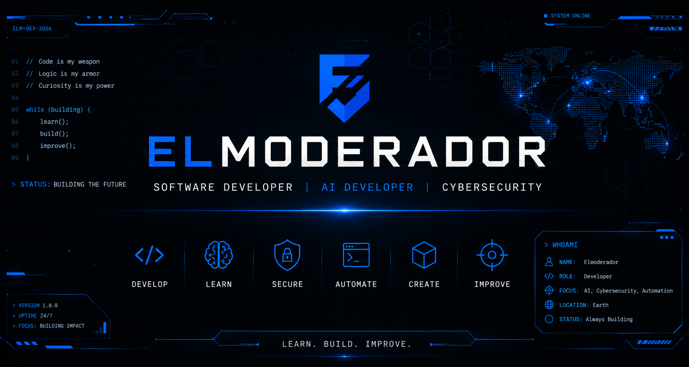

  

  

  

  

  
  
  

---

# 👋 Welcome

I'm passionate about software development, artificial intelligence, cybersecurity, and building open-source projects.

This profile serves as my personal portfolio where I publish projects, experiments, and ideas while continuously improving my technical skills.

---

# 🚀 Current Focus

- 🤖 Artificial Intelligence
- 🛡️ Cybersecurity
- ⛏️ Minecraft Plugin Development
- 🌍 Open Source Development

---

# 🛠️ Tech Stack

| Languages | Frameworks & APIs | Tools | Databases |
|-----------|-------------------|--------|-----------|
| Python • Java • JavaScript • C++ | Node.js • Paper API • Spigot API | Git • GitHub • Linux • VS Code | MySQL • MongoDB |

---

# 📂 Featured Projects

> 🚧 Projects will be added here as they reach production quality.

| Project | Description | Status | Priority |
|---------|-------------|--------|----------|
| 🤖 AI Assistant | Local AI assistant focused on automation, extensibility and local execution. | ⏸️ On Hold | ⭐ Medium |
| ⛏️ Minecraft Plugins | Plugins developed for Paper & Spigot servers. | 🟢 Active Development | 🔥 Highest |
| 🛡️ Cybersecurity Tools | Utilities, automation and security-related experiments. | ⏸️ On Hold | ⭐ Medium |
| 🎮 Game Development | Personal games and development tools. | ⏸️ On Hold | 💡 Low |

---

# 📖 Development Status

<table>
<tr>

<td valign="top" width="50%">

| Emoji | Status |
|:--:|--------------------|
| 📋 | Planning |
| 🟡 | Research |
| 🔵 | Prototype |
| 🟢 | Active Development |
| 🟣 | Testing |
| 🚀 | Beta |

</td>

<td valign="top" width="50%">

| Emoji | Status |
|:--:|----------------|
| 🟠 | Refactoring |
| ⚪ | Maintenance |
| ⏸️ | On Hold |
| ✅ | Released |
| 🏁 | Completed |
| 🛑 | Archived |

</td>

</tr>
</table>

---

# 🔥 Project Priority

| Emoji | Priority |
|:--:|---------------------------|
| 🔥 | Highest Priority |
| ⭐ | Medium Priority |
| 💡 | Low Priority / Side Project |

---

## Primary Technologies

-  Python
-  Java

## Working Knowledge

-  C++
-  JavaScript
-  Git
-  GitHub
-  Linux
-  MySQL
-  MongoDB

---

# 🎯 Goals

- 🚀 Build high-quality open-source software.
- 📚 Publish polished and well-documented projects.
- 🤖 Develop practical AI applications.
- 🛡️ Expand my cybersecurity knowledge.
- 🌍 Contribute to the open-source community.

⭐ **If you find any of my projects useful, consider giving them a star!**

---

# 📚 Currently Learning

- Artificial Intelligence
- Machine Learning
- Java Backend Development
- Cybersecurity
- Software Architecture

---

# 💭 Development Principles

- ✅ Write clean, maintainable code.
- ✅ Learn continuously.
- ✅ Prioritize quality over quantity.
- ✅ Document everything properly.
- ✅ Build software that solves real problems.
- ✅ Never stop improving.

---

# 📜 License

Unless otherwise specified, each repository includes its own license.

---

# 💡 Philosophy

> *"Code with purpose. Learn continuously. Build what matters."*

---

  <b>Thanks for visiting my profile.</b>
    
  <i>Always building something new.</i>

