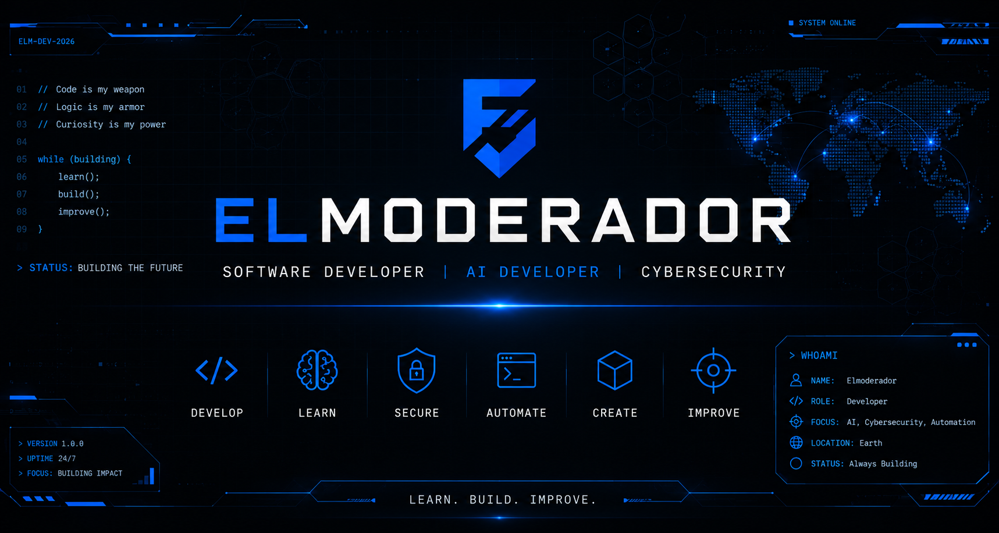

  

  

  

  

  
  
  
  

---

# 👋 Welcome

I'm a software developer focused on building open-source projects, automation tools, Minecraft systems, artificial intelligence experiments and cybersecurity-related projects.

This profile serves as my personal portfolio, where I share projects, experiments and technical progress while continuously improving my development skills.

---

# 🚀 Current Focus

Currently focused on developing software in the following areas:

- ⛏️ Minecraft Plugin Development
- 🏗️ Software Architecture
- 🤖 Artificial Intelligence
- 🛡️ Cybersecurity
- 🌍 Open Source Development

---

# 🛠️ Tech Stack

| Languages | Frameworks & APIs | Tools | Databases |
|-----------|-------------------|--------|-----------|
| Python • Java • JavaScript • C++ | Paper API • Spigot API • Node.js | Git • GitHub • Linux • VS Code • Maven | MySQL • MongoDB |

---

# 📂 Featured Projects

> Projects listed below represent my main development areas. Their status is updated as development progresses.

| Project | Description | Status | Priority |
|---------|-------------|--------|----------|
| ⛏️ [TimeEconomyPlugin](https://github.com/Elmoderador/TimeEconomyPlugin) | Custom Minecraft server plugin providing gameplay systems, progression mechanics, server management features and integrations. | ✅	Released (v1.0.0 Released) | ⭐ Medium |
| 🤖 Discord Bot | Modular Discord bot focused on automation, moderation and community management. | 🟢 Active Development | 🔥 Highest |
| 🛡️ Cybersecurity Tools | Security utilities, automation tools and experimental projects. | ⏸️ On Hold | 💡 Low |
| 🎮 Game Development | Personal games and experimental game development projects. | ⏸️ On Hold | 💡 Low |

---

# ⭐ Featured Project

## ⛏️ [TimeEconomyPlugin](https://github.com/Elmoderador/TimeEconomyPlugin)

A custom Minecraft server plugin developed with Java and Paper API, providing custom gameplay systems, progression mechanics and server management features.

### Features

- ⏳ Time Economy System
- ⚔️ Player Classes
- 🗡️ Legendary Weapons
- 🏰 Clan System
- 🔐 Authentication System
- 🤖 Discord Integration

### Technologies

- Java 21
- Paper API 1.21+
- Maven
- YAML Data Storage

Status: 🟢 Active Development (v1.0.0 Released)

---

# 📖 Development Status & Project Priority

<table width="100%" border="0" cellpadding="0" cellspacing="0">
<tr>

<td valign="top" width="32%">

<table width="100%">
<thead>
<tr>
<th align="center" width="25%">Emoji</th>
<th align="left">Status</th>
</tr>
</thead>

<tbody>
<tr><td align="center">📋</td><td>Planning</td></tr>
<tr><td align="center">🟡</td><td>Research</td></tr>
<tr><td align="center">🔵</td><td>Prototype</td></tr>
<tr><td align="center">🟢</td><td>Active Development</td></tr>
<tr><td align="center">🟣</td><td>Testing</td></tr>
<tr><td align="center">🚀</td><td>Beta</td></tr>
</tbody>

</table>

</td>

<td width="2%"></td>

<td valign="top" width="32%">

<table width="100%">
<thead>
<tr>
<th align="center" width="25%">Emoji</th>
<th align="left">Status</th>
</tr>
</thead>

<tbody>
<tr><td align="center">🟠</td><td>Refactoring</td></tr>
<tr><td align="center">⚪</td><td>Maintenance</td></tr>
<tr><td align="center">⏸️</td><td>On Hold</td></tr>
<tr><td align="center">✅</td><td>Released</td></tr>
<tr><td align="center">🏁</td><td>Completed</td></tr>
<tr><td align="center">🛑</td><td>Archived</td></tr>
</tbody>

</table>

</td>

<td width="2%"></td>

<td valign="top" width="32%">

<table width="100%">
<thead>
<tr>
<th align="center" width="25%">Emoji</th>
<th align="left">Priority</th>
</tr>
</thead>

<tbody>
<tr><td align="center">🔥</td><td>Highest Priority</td></tr>
<tr><td align="center">⭐</td><td>Medium Priority</td></tr>
<tr><td align="center">💡</td><td>Low Priority / Side Project</td></tr>
</tbody>

</table>

</td>

</tr>
</table>

---

# 💻 Primary Technologies

These are the technologies I currently use the most.

###  Python

Main language for automation, artificial intelligence experiments and general-purpose development.

- Artificial Intelligence
- Automation
- Desktop Applications
- Scripting
- General Development

---

###  Java

Main language for Minecraft plugin development and backend systems.

- Minecraft Plugin Development
- Paper API
- Spigot API
- Object-Oriented Programming
- Backend Development
- Software Architecture

---

# 🧩 Working Knowledge

| | |
|---|---|
|  C++ |  Linux |
|  JavaScript |  MySQL |
|  Git |  MongoDB |
|  GitHub |  Node.js |

---

# 🎯 Goals

- 🚀 Build high-quality open-source software.
- 📚 Publish polished and well-documented projects.
- 🏗️ Design scalable software architectures.
- 🤖 Develop practical automation tools.
- 🛡️ Expand cybersecurity knowledge.
- 🌍 Contribute to the open-source community.

⭐ **If you find any of my projects useful, consider giving them a star!**

---

# 📚 Currently Learning

- Artificial Intelligence & Machine Learning
- Cybersecurity
- Advanced Software Architecture
- Backend Engineering
- Scalable System Design

---

# 💭 Development Principles

- ✅ Write clean and maintainable code.
- ✅ Learn continuously.
- ✅ Prioritize quality over quantity.
- ✅ Document projects properly.
- ✅ Build software that solves real problems.
- ✅ Keep improving every day.

---

# 📜 License

Unless otherwise specified, each repository includes its own license.

---

# 💡 Philosophy

> *"Code with purpose. Learn continuously. Build what matters."*

---

  <b>Thanks for visiting my profile.</b>
    
  Open Source • Software Development • Cybersecurity • Artificial Intelligence

